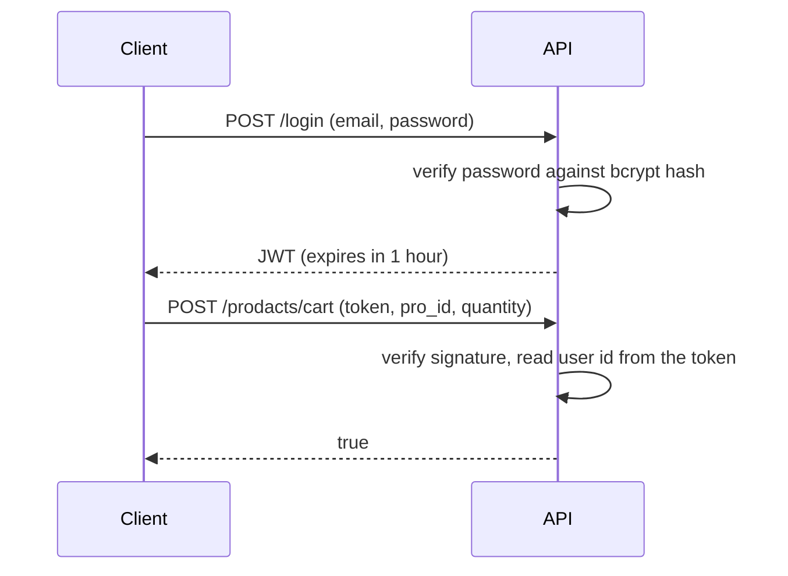
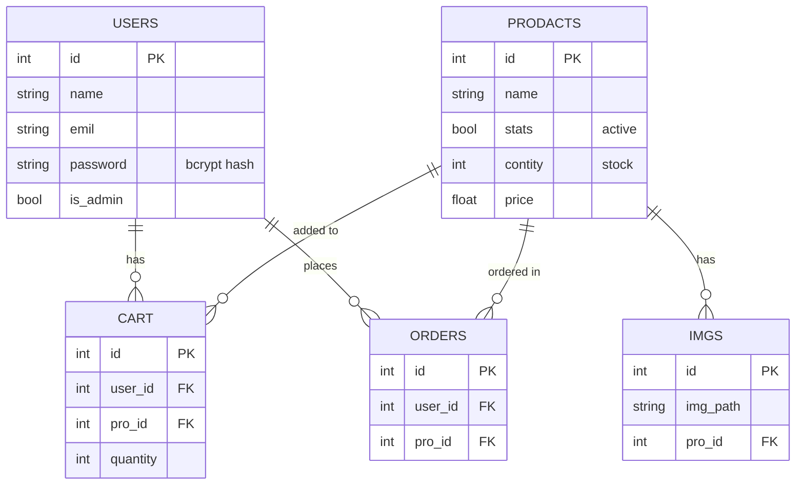

# ⚡ Electro: Backend


REST API for the **Electro** store, built with **FastAPI** and **SQLAlchemy**. It handles authentication, the product catalog, per-user carts, purchases, the admin dashboard, and a Gemini-powered shopping assistant.

**Live API docs:** [electro-backend-2dx5.onrender.com/docs](https://electro-backend-2dx5.onrender.com/docs)

**Live app:** [electro-frontend-khaki.vercel.app](https://electro-frontend-khaki.vercel.app/login). The Next.js storefront that consumes this API lives in its own repository.

---

## Contents

- [Tech Stack](#tech-stack)
- [Project Structure](#project-structure)
- [Getting Started](#getting-started)
- [Environment Variables](#environment-variables)
- [Authentication Flow](#authentication-flow)
- [API Reference](#api-reference)
- [AI Assistant](#ai-assistant)
- [Concurrency and Stock Safety](#concurrency-and-stock-safety)
- [Data Model](#data-model)
- [Deployment](#deployment)
- [Troubleshooting](#troubleshooting)
- [Known Limitations](#known-limitations)

## Tech Stack

| Purpose | Technology |
|---|---|
| Web framework | FastAPI, Uvicorn, Pydantic |
| ORM | SQLAlchemy |
| Database | PostgreSQL (production), SQLite (local development) |
| Auth | JWT (`python-jose`, HS256), bcrypt via `passlib` |
| AI | Google Gemini (`google-generativeai`) |
| Config | `python-dotenv` |

## Project Structure

```
.
├── main.py            # SQLAlchemy models, engine/session setup, seed data
├── modul.py           # FastAPI app: CORS, auth, routes
├── ai.py              # Gemini AI assistant
├── requirements.txt
├── .env               # secrets (not committed)
└── .env.example       # template for .env
```

## Getting Started

**Requirements:** Python 3.10+

```bash
git clone <this-repo-url>
cd <folder-name>
python -m venv venv

# Windows
venv\Scripts\activate
# macOS / Linux
source venv/bin/activate

pip install -r requirements.txt
cp .env.example .env      # then fill in the values
```

Create the tables and seed the sample products plus the default admin account:

```bash
python main.py
```

> Run the seed **once**; running it again inserts the products a second time. Change the default admin credentials in `main.py` before seeding.

Start the server:

```bash
uvicorn modul:app --reload
```

- API: `http://127.0.0.1:8000`
- Interactive docs (Swagger): `http://127.0.0.1:8000/docs`

## Environment Variables

| Variable | Required | Description |
|---|---|---|
| `GEMINI_API_KEY` | For the AI assistant | Google Gemini API key |
| `DATABASE_URL` | Production | PostgreSQL connection string. Local development can use the bundled SQLite file |
| `SECURITY_KEY` | Yes | Secret used to sign and verify JWTs. Use a long random string. Changing it logs everyone out |

Never commit `.env`. Keep it in `.gitignore`.

## Authentication Flow



The client never sends a `user_id`. The server derives it from the verified token, so a user can only act on their own cart. Admin endpoints additionally re-check `is_admin` in the database on every request.

## API Reference

CORS is restricted to an allow-list in `modul.py`. Add your frontend origin there.

### Public

| Method | Endpoint | Body | Response |
|---|---|---|---|
| `POST` | `/signup` | `{ emil, password, name }` | `true`, or `false` if the email already exists |
| `POST` | `/login` | `{ emil, password }` | `{ token }`, or `false` on bad credentials |
| `GET` | `/prodacts` | none | List of active products with image paths and stock |
| `POST` | `/api/ai-assistant` | `{ message }` | `{ reply }` |

### Authenticated

| Method | Endpoint | Input | Description |
|---|---|---|---|
| `POST` | `/prodacts/cart` | `{ pro_id, token, quantity }` | Add a product to the user's cart |
| `GET` | `/cart?token=<jwt>` | query string | The user's cart items, including name, price and image |
| `POST` | `/cart/remove` | `{ id, token }` | Remove a cart item |
| `POST` | `/prodacts/order` | `{ pro_id, token }` | Purchase a product (decrements stock) |

### Admin only

| Method | Endpoint | Description |
|---|---|---|
| `POST` | `/admin/users` | List users |
| `POST` | `/admin/users/update` | Change a user's `is_admin` flag |
| `POST` | `/admin/users/delete` | Delete a user |
| `POST` | `/admin/products` | List all products |
| `POST` | `/admin/products/create` | Create a product |
| `POST` | `/admin/products/update` | Update a product |
| `POST` | `/admin/products/delete` | Delete a product |

All admin endpoints take `token` in the body.

## AI Assistant

`POST /api/ai-assistant` builds a prompt from the store's **live product list** (name, price, stock for every active product) and sends it to Gemini together with the customer's question. The prompt tells the model to answer only from that list, so it cannot recommend items the store doesn't sell, and to reply in Arabic. The API key stays on the server and never reaches the browser.

If the endpoint returns 500, check the server log for the underlying Gemini error. Retired model names are the most common cause.

## Concurrency and Stock Safety

Two customers can click **Buy** on the last unit at the same moment. A naive flow that reads the stock, checks it in Python, and then writes `stock - 1` would let both requests pass the check and push the stock below zero.

Electro avoids this race condition by moving the check into the database. A purchase is one atomic statement:

```sql
UPDATE prodacts
SET contity = contity - 1
WHERE id = :pro_id AND contity > 0;
```

The database applies the update row by row, so only one of the competing requests can match the last unit. The other updates zero rows, and the endpoint reports that the purchase failed. Stock never goes below zero and no unit is sold twice.

## Data Model



> Table and field names (`prodacts`, `emil`, `contity`) are kept exactly as they appear in the code.

## Deployment

Deployed on **Render**.

| Setting | Value |
|---|---|
| Root directory | repository root |
| Build command | `pip install -r requirements.txt` |
| Start command | `uvicorn modul:app --host 0.0.0.0 --port $PORT` |
| Environment | `GEMINI_API_KEY`, `DATABASE_URL`, `SECURITY_KEY` |

After deploying the frontend, add its origin (`https://electro-frontend-khaki.vercel.app`) to the CORS `allow_origins` list. On the free tier the service sleeps when idle, so the first request after a pause can take up to a minute.

## Troubleshooting

**`ValueError: password cannot be longer than 72 bytes`** when hashing or verifying passwords

`passlib` 1.7.4 is incompatible with `bcrypt` 5.x. Pin the older release and add it to `requirements.txt` so deployments use it as well:

```
bcrypt==4.0.1
```

**`table ... has no column named ...`** after changing a model

SQLAlchemy creates missing tables but does not alter existing ones. In development, drop the table (or delete `main.db`) and let it be recreated. For production data, use a migration tool such as Alembic.

**`This session is in 'prepared' state` / `PendingRollbackError`**

A previous request failed during a commit and left the shared session broken. Call `session.rollback()` in the `except` block of any route that writes, then restart the server.

**Browser shows `Failed to fetch` or a CORS error**

Confirm the server is running and the frontend's origin is in `allow_origins`. An unhandled exception inside a route can also surface in the browser as a CORS error, so check the server log first.

## Known Limitations

- Tokens travel in the request body or query string instead of an `Authorization` header.
- One shared SQLAlchemy session is used for all requests; it should become a per-request dependency.
- No rate limiting on login or the AI endpoint.
- Checkout is a simulation; there is no payment gateway.
- Password reset by emailed code is in progress.
